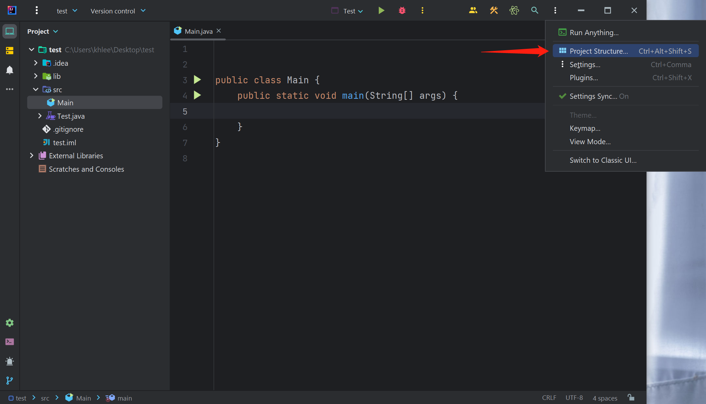
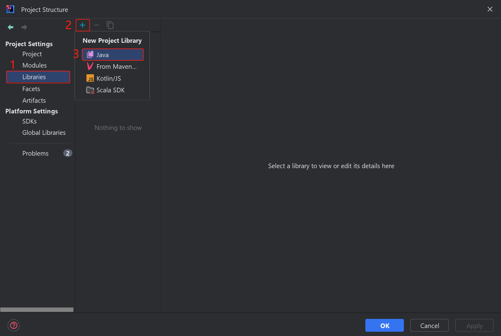
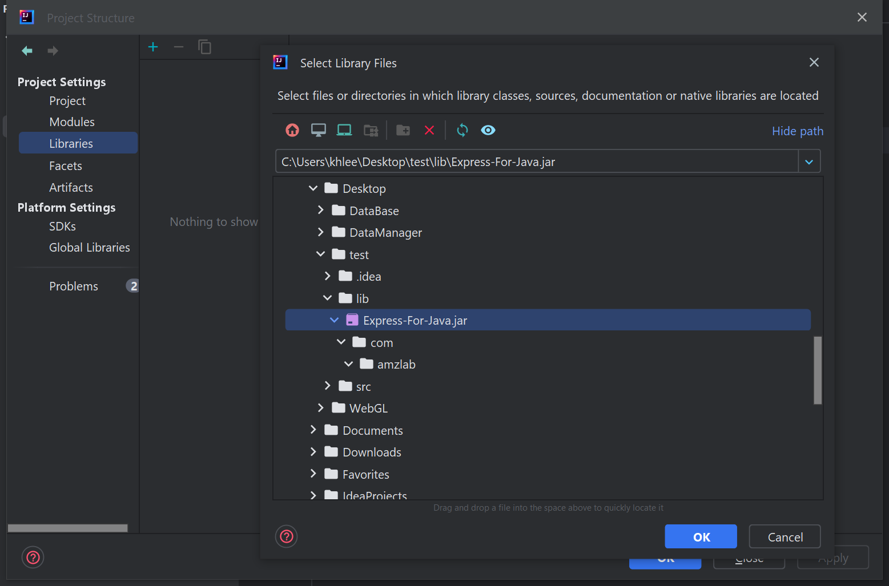
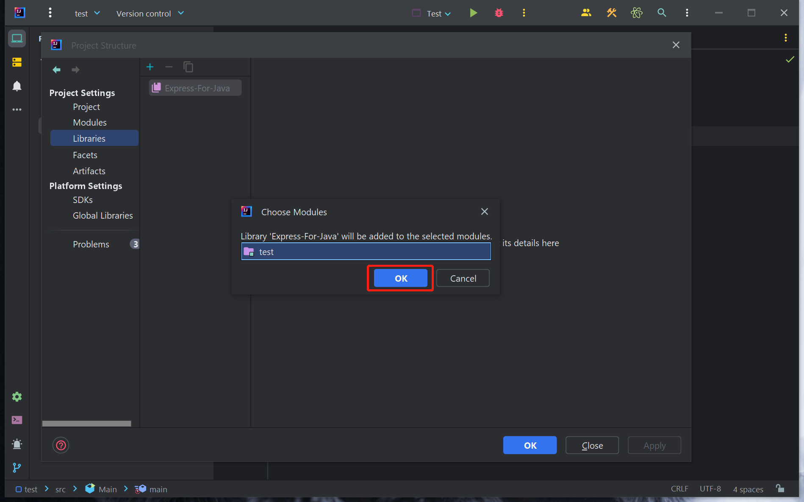
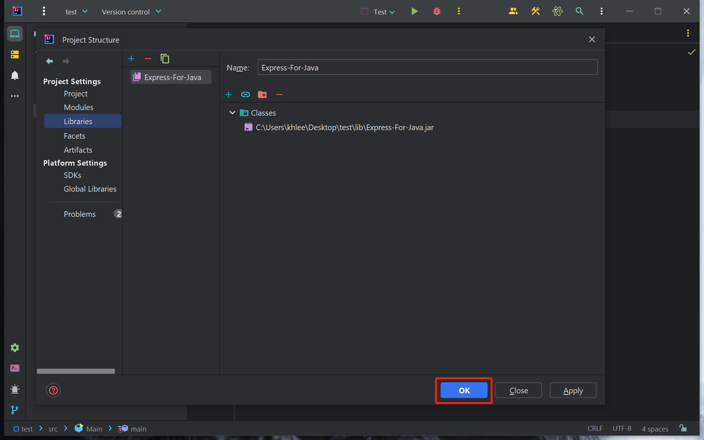
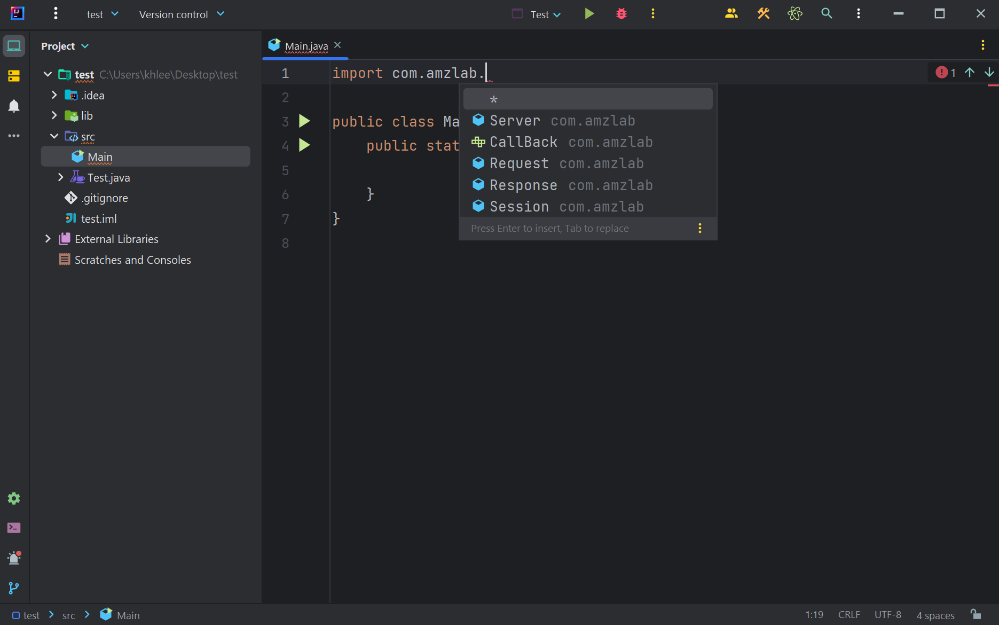

# Java Express

使用 Java 实现的一个类似 NodeJS Express 的 WEB 框架。

## 使用方法

首先，请前往 [Release](https://github.com/AmzGrainRain/Express-For-Java/releases) 页面下载最新的 jar 包。

打开 IntelliJ 的项目结构设置：

在库设置页面点击加号添加一个库：

找到先前下载的 jar 包，选中并点击确定：

在项目里通过 import com.amzlab.* 使用：

